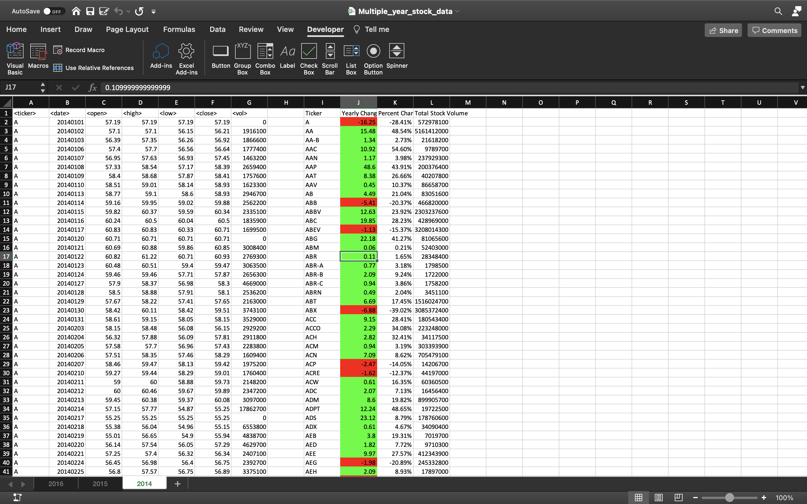
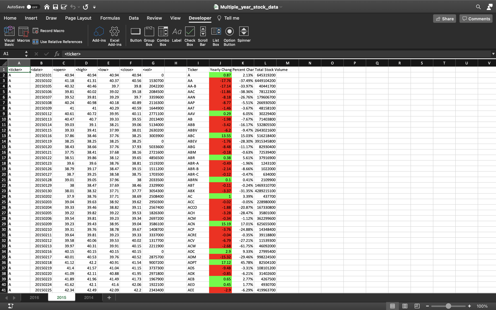
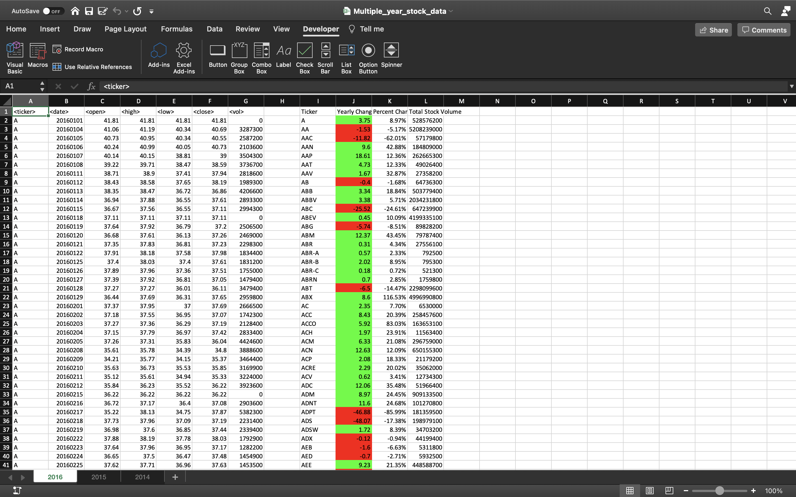

# vba-challenge
### Visual Basic for Applications because hey, you never know.

In this demonstration of my VBA skills, we were provided with three years worth of stock information. I used VBA to write a macro that would loop through all of the data and get it organized and analyzed. The macro is in this repository, and below are a few screen shots of the results.

Pretty straight forward run of the mill stock analysis. Definitely NBD. If you have any questions, feel free to contact me. Have a fantastic one.
