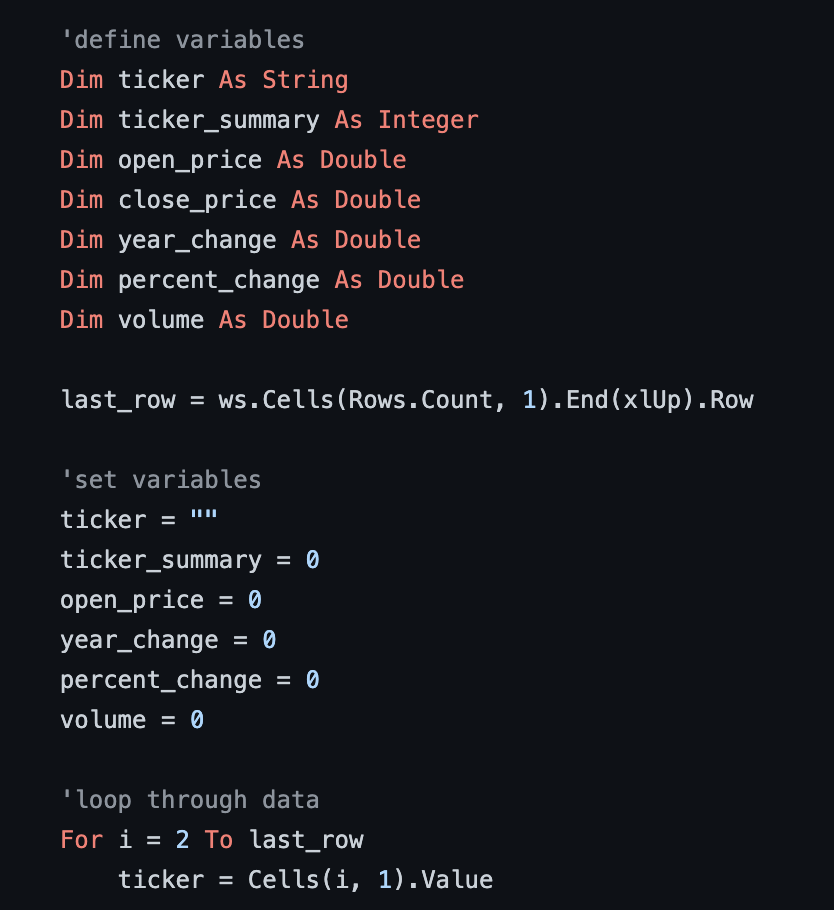

# vba-challenge
### Visual Basic for Applications because hey, you never know.

Visual Basic for Applications, or VBA, is the programming language that some genius came up with for Excel. While not especially common anymore thanks to higher languages like Python, I still feel it's a useful tool to demonstrate.

In this exercise, I was provided with an Excel spreadsheet containing three years worth of stock data. We're talking opening price, closing price, ticker symbol, the whole shebang. Using VBA, I was able to sort the data, manipulate the data, perform a few calculations, and return results based on the dataset. Below are a few screenshots of some of my code and the end results for each year I had data for (2014-2016). Of course, the full code is in this very repository.

